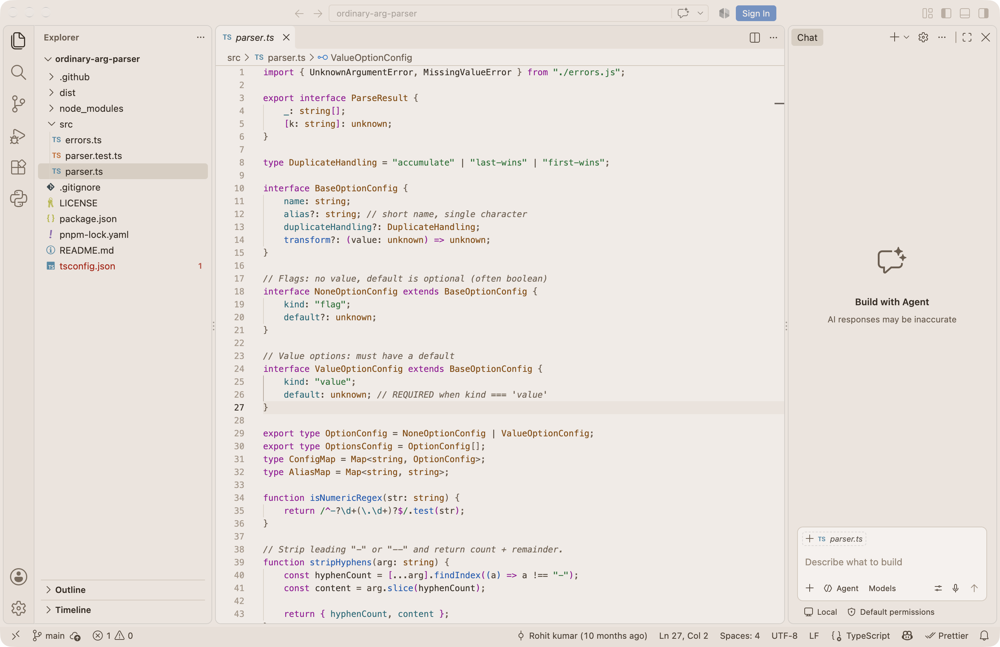

# Breadog for VS Code

A warm, light theme for [VS Code](https://code.visualstudio.com), ported from the Breadog terminal color scheme.



Breadog pairs a soft beige background (`#f1ebe6`) with dark brown text (`#362c24`). The built-in terminal uses the original 16 Breadog colors, so it matches Ghostty, iTerm2, and other terminals that ship Breadog.

Also available for [Zed](https://github.com/RibbtDev/breadog-zed).

## Install

1. Open the Extensions view (`Cmd+Shift+X` on macOS, `Ctrl+Shift+X` elsewhere).
2. Search for **Breadog Theme** and install it.
3. Run **Preferences: Color Theme** from the command palette and pick **Breadog**.

Or set it in `settings.json`:

```json
{
  "workbench.colorTheme": "Breadog"
}
```

Works in Cursor, VSCodium, and Windsurf too, through [Open VSX](https://open-vsx.org).

## Credits

The Breadog palette comes from [iTerm2-Color-Schemes](https://github.com/mbadolato/iTerm2-Color-Schemes) ([#559](https://github.com/mbadolato/iTerm2-Color-Schemes/pull/559)), released under the MIT License.

## License

[MIT](LICENSE)
